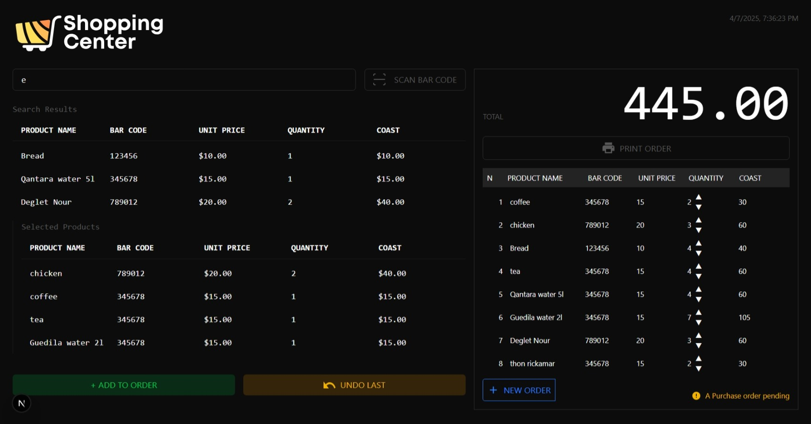

# Cashier System

## Overview
This is a modern cashier system built using **Next.js**, designed for managing sales transactions in a retail environment. The system provides an intuitive and efficient interface for scanning barcodes, adding products to orders, processing payments, and printing receipts.

## Features
- **Product Search & Barcode Scanning**: Search for products manually or scan barcodes for quick entry.
- **Order Management**: Add, remove, and modify product quantities before finalizing an order.
- **Automatic Cost Calculation**: Displays total cost dynamically based on selected products.
- **Payment Processing**: Supports card payments.
- **Receipt Printing**: Generates printable receipts for completed transactions.
- **Dark Mode UI**: A sleek, modern user interface with a dark theme.

## Screenshot


## Installation
To set up the system on your local machine:

1. Clone the repository:
   ```sh
   git clone https://github.com/nerddude24/cashier-front.git
   cd cashier-front
   ```

2. Install dependencies:
   ```sh
   npm install
   # or
   yarn install
   ```

3. Run the development server:
   ```sh
   npm run dev
   # or
   yarn dev
   ```

4. Open the application in your browser at:
   ```sh
   http://localhost:3000
   ```

## Usage
1. Search for products by name or scan a barcode
2. Adjust the quantity as needed.
3. Review the total amount displayed on the screen.
4. Click **Pay Using Card** to complete the transaction.
5. Print the receipt if required.
6. Click **New Order** to reset and start a new transaction.

## Technologies Used
- **Next.js** – Frontend framework
- **React.js** – UI components
- **Tailwind CSS** – Styling
